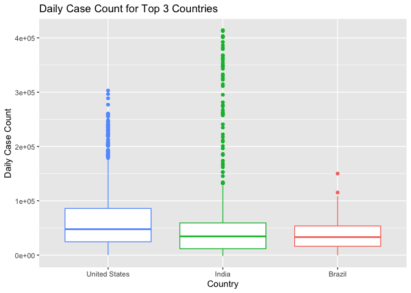
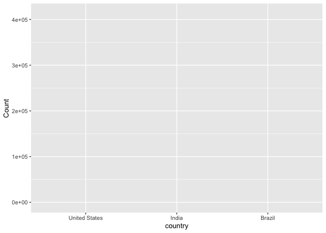
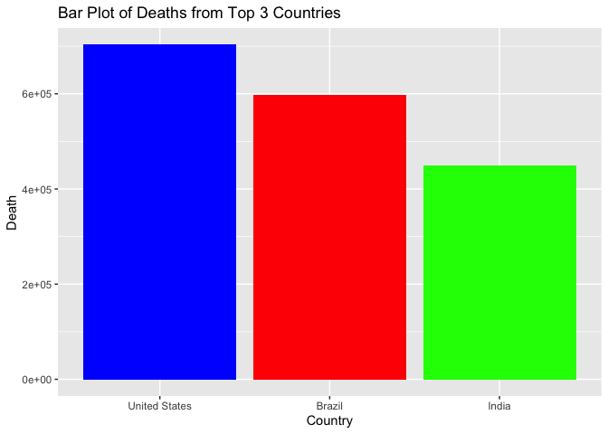
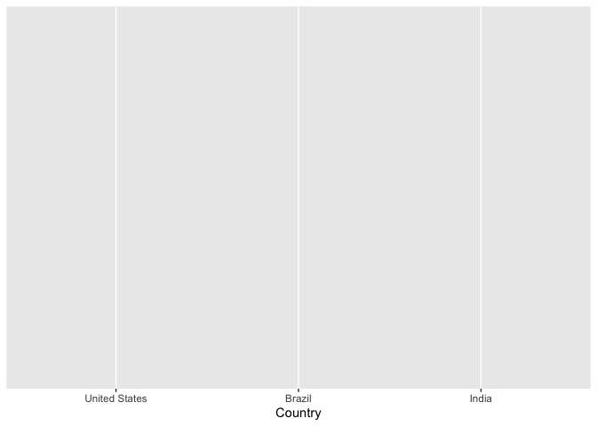
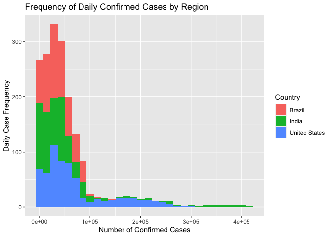
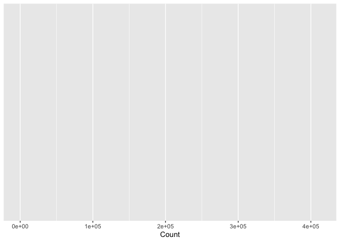
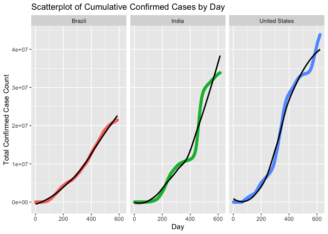
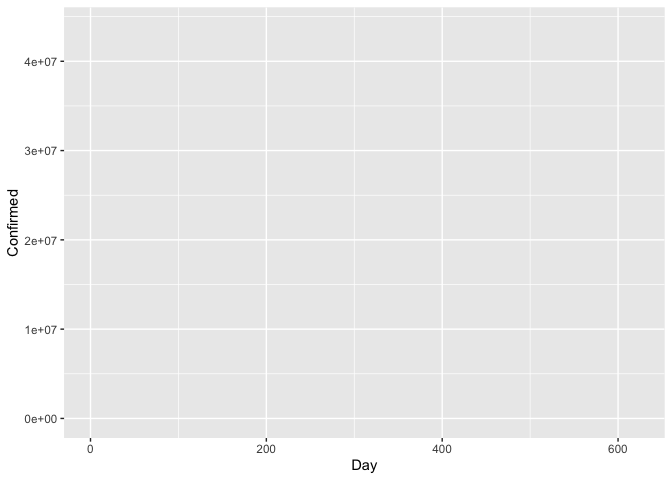
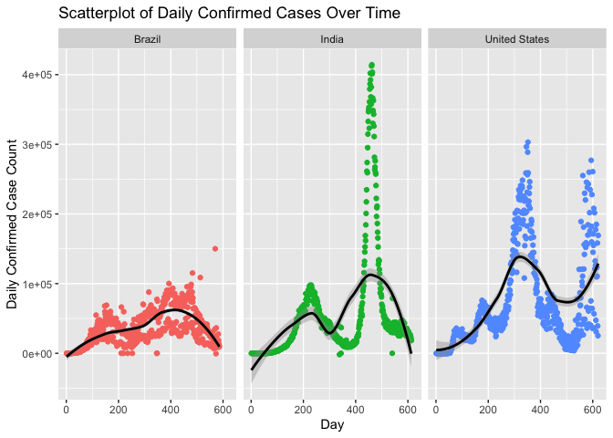
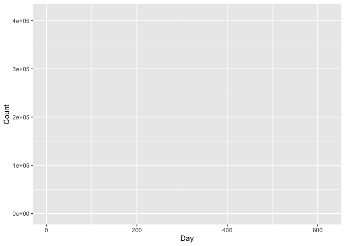

README
================
Alex Prevatte
10/2/2021

# Code to Create this Document

``` r
rmarkdown::render("~/NCSU/ST558/Repos/ST558-Project1/README.Rmd", 
              output_format = "github_document", 
              output_dir = "~/NCSU/ST558/Repos/ST558-Project1",
              output_options = list(
                html_preview = FALSE
                )
              )
```

## Create vignette for reading and summarizing data from the API

# Requirements

packages needed to run the code to create vignette

``` r
library(httr)
library(jsonlite)
library(tidyverse)
library(RCurl)
```

The confirmed function is used to return total and new confirmed
COVID-19 case counts for a country of interest. To return the total case
count for all countries, “all” can be used. These total counts are
updated daily.

``` r
confirmed <- function(country = "all"){
  ###
  # This function returns total and new COVID case count
  ###
  
  # Obtain data from summary endpoint
  o <- fromJSON(
    "https://api.covid19api.com/summary"
    )
  
  # View countries
  output <- o$Countries
  
  # If country input is not "all", filter rows accordingly
  if (country != "all"){
    
  # Filter rows based on country selected. 
  # Select Country,TotalConfirmed, and NewConfirmed variables
   if (country %in% output$Country){
    sub <- output %>%
       filter(Country == country) %>%
       select(Country,TotalConfirmed,NewConfirmed)
   }
  
  # Filter rows based on selected Country Code. 
  # Select Country,TotalConfirmed, and NewConfirmed variables
  else if (country %in% output$CountryCode){
    sub <- output %>%
      filter(CountryCode == country) %>%
      select(Country,TotalConfirmed,NewConfirmed)
  }
  
  # Filter rows based on selected Slug 
  # Select Country,TotalConfirmed, and NewConfirmed variables
  else if (country %in% output$Slug){
    sub <- output %>%
      filter(Slug == country) %>%
      select(Country,TotalConfirmed,NewConfirmed)
  }
  
  # If Country, Country Code, or Slug is not found, return error message. 
  else {
    message <- paste("ERROR: Country was not found in Country,
                     CountryCode, or Slug columns. Check spelling.")
    stop(message)
  }
}
  # Return Country, TotalConfirmed, and NewConfirmed variables 
  # from all countries
  else { 
    sub <- output %>%
      select(Country,TotalConfirmed,NewConfirmed)
    }
  return(sub)
}
```

The deaths function is used to return total and new COVID-19 deaths for
a country of interest. To return the total case count for all countries,
“all” can be used. These total counts are updated daily.

``` r
deaths <- function(country = "all"){
  ###
  # This function returns total and new COVID deaths
  ###
  
  # Obtain data from summary endpoint
  o <- fromJSON(
    "https://api.covid19api.com/summary"
    )
  
  # View countries
  output <- o$Countries
  
  # If country input is not "all", filter rows accordingly
  if (country != "all"){
    
  # Filter rows based on country selected. 
  # Select Country,TotalDeaths, and NewDeaths variables
  if (country %in% output$Country){
    sub <- output %>%
       filter(Country == country) %>%
       select(Country,TotalDeaths,NewDeaths)
   }
  
  # Filter rows based on Country Code selected. 
  # Select Country,TotalDeaths, and NewDeaths variables
  else if (country %in% output$CountryCode){
    sub <- output %>%
      filter(CountryCode == country) %>%
      select(Country,TotalDeaths,NewDeaths)
  }
  
  # Filter rows based on Slug selected. 
  # Select Country,TotalDeaths, and NewDeaths variables
  else if (country %in% output$Slug){
    sub <- output %>%
      filter(Slug == country) %>%
      select(Country,TotalDeaths,NewDeaths)
  }
  
  # If Country, Country Code, or Slug is not found, return error message. 
  else {
    message <- paste("ERROR: Country was not found in Country,
                     CountryCode, or Slug columns. Check spelling.")
    stop(message)
  }
  }
  # Return Country, TotalDeaths, and NewDeaths variables 
  # from all countries
  else { 
       sub <- output %>%
       select(Country,TotalDeaths,NewDeaths)
    }
  return(sub)
}
```

The daily function is used to return all cases by case type for a
country from the first recorded case. These total counts are updated
daily.

``` r
daily <- function(country) {
  ###
  # This function returns total cases by case type for a specified country
  ###
  
  # Construct URL for country flexibility
  baseURL <- "https://api.covid19api.com/dayone/country/"
  value <- country
  # Return only blank provinces
  last <- "?province=+"
  URL <- paste0(baseURL, value, last)
  out <- RCurl::getURL(URL)
  o <- fromJSON(URL)
  
  # Subset dataset to return Country, Province, Confirmed, Deaths,
  # Recovered, Active, and Date variables
  sub <- o %>%
       select(Country, Province, Confirmed, 
              Deaths, Recovered, Active, Date)
  
  return(sub)
}
```

The live function is used to return all live confirmed cases (10 minute
increments) for the country of interest. These live counts are updated
every 10 minutes.

``` r
live <- function(country) {
  ###
  # This function returns live confirmed cases by country
  ###
  
  # Construct URL for country flexibility
  baseURL <- "https://api.covid19api.com/live/country/"
  value <- country
  # Return all provinces
  region <- "?province=+"
  last <- "/status/confirmed"
  URL <- paste0(baseURL, value, region, last)
  out <- RCurl::getURL(URL)
  o <- fromJSON(out)
  
  # Subset dataset to return Country, Province, Confirmed, and Date variables
  sub <- o %>%
       select(Country, Province, Confirmed, Date)
  
  return(sub)
}
```

The dateFilter function is used to return cumulative daily confirmed
cases for a given range of dates for the country of interest.

``` r
dateFilter <- function(country, covidStart, covidEnd) {
  ###
  # This function returns live confirmed cases by country
  ###
  
  # Construct URL for country flexibility
  baseURL <- "https://api.covid19api.com/country/"
  value <- country
  
  # Add remaining URL pieces with time stamp
  status <- "/status/confirmed?from="
  start <- covidStart
  from <- "T00:00:00Z&to="
  end <- covidEnd
  to <- "T00:00:00Z"
  URL <- paste0(baseURL, value, status, start, from, end, to)
  out <- RCurl::getURL(URL)
  o <- fromJSON(out)
  
  # Subset dataset to return Country, Province, Confirmed, and Date variables
  sub <- o %>%
       select(Country, Province, Cases, Status, Date)
  
  return(sub)
}

dateFilter("south-africa", "2020-06-01", "2020-08-01")
```

    ##         Country Province  Cases    Status                 Date
    ## 1  South Africa           34357 confirmed 2020-06-01T00:00:00Z
    ## 2  South Africa           35812 confirmed 2020-06-02T00:00:00Z
    ## 3  South Africa           37525 confirmed 2020-06-03T00:00:00Z
    ## 4  South Africa           40792 confirmed 2020-06-04T00:00:00Z
    ## 5  South Africa           43434 confirmed 2020-06-05T00:00:00Z
    ## 6  South Africa           45973 confirmed 2020-06-06T00:00:00Z
    ## 7  South Africa           48285 confirmed 2020-06-07T00:00:00Z
    ## 8  South Africa           50879 confirmed 2020-06-08T00:00:00Z
    ## 9  South Africa           52991 confirmed 2020-06-09T00:00:00Z
    ## 10 South Africa           55421 confirmed 2020-06-10T00:00:00Z
    ## 11 South Africa           58568 confirmed 2020-06-11T00:00:00Z
    ## 12 South Africa           61927 confirmed 2020-06-12T00:00:00Z
    ## 13 South Africa           65736 confirmed 2020-06-13T00:00:00Z
    ## 14 South Africa           70038 confirmed 2020-06-14T00:00:00Z
    ## 15 South Africa           73533 confirmed 2020-06-15T00:00:00Z
    ## 16 South Africa           76334 confirmed 2020-06-16T00:00:00Z
    ## 17 South Africa           80412 confirmed 2020-06-17T00:00:00Z
    ## 18 South Africa           83890 confirmed 2020-06-18T00:00:00Z
    ## 19 South Africa           87715 confirmed 2020-06-19T00:00:00Z
    ## 20 South Africa           92681 confirmed 2020-06-20T00:00:00Z
    ## 21 South Africa           97302 confirmed 2020-06-21T00:00:00Z
    ## 22 South Africa          101590 confirmed 2020-06-22T00:00:00Z
    ## 23 South Africa          106108 confirmed 2020-06-23T00:00:00Z
    ## 24 South Africa          111796 confirmed 2020-06-24T00:00:00Z
    ## 25 South Africa          118375 confirmed 2020-06-25T00:00:00Z
    ## 26 South Africa          124590 confirmed 2020-06-26T00:00:00Z
    ## 27 South Africa          131800 confirmed 2020-06-27T00:00:00Z
    ## 28 South Africa          138134 confirmed 2020-06-28T00:00:00Z
    ## 29 South Africa          144264 confirmed 2020-06-29T00:00:00Z
    ## 30 South Africa          151209 confirmed 2020-06-30T00:00:00Z
    ## 31 South Africa          159333 confirmed 2020-07-01T00:00:00Z
    ## 32 South Africa          168061 confirmed 2020-07-02T00:00:00Z
    ## 33 South Africa          177124 confirmed 2020-07-03T00:00:00Z
    ## 34 South Africa          187977 confirmed 2020-07-04T00:00:00Z
    ## 35 South Africa          196750 confirmed 2020-07-05T00:00:00Z
    ## 36 South Africa          205721 confirmed 2020-07-06T00:00:00Z
    ## 37 South Africa          215855 confirmed 2020-07-07T00:00:00Z
    ## 38 South Africa          224665 confirmed 2020-07-08T00:00:00Z
    ## 39 South Africa          238339 confirmed 2020-07-09T00:00:00Z
    ## 40 South Africa          250687 confirmed 2020-07-10T00:00:00Z
    ## 41 South Africa          264184 confirmed 2020-07-11T00:00:00Z
    ## 42 South Africa          276242 confirmed 2020-07-12T00:00:00Z
    ## 43 South Africa          287796 confirmed 2020-07-13T00:00:00Z
    ## 44 South Africa          298292 confirmed 2020-07-14T00:00:00Z
    ## 45 South Africa          311049 confirmed 2020-07-15T00:00:00Z
    ## 46 South Africa          324221 confirmed 2020-07-16T00:00:00Z
    ## 47 South Africa          337594 confirmed 2020-07-17T00:00:00Z
    ## 48 South Africa          350879 confirmed 2020-07-18T00:00:00Z
    ## 49 South Africa          364328 confirmed 2020-07-19T00:00:00Z
    ## 50 South Africa          373628 confirmed 2020-07-20T00:00:00Z
    ## 51 South Africa          381798 confirmed 2020-07-21T00:00:00Z
    ## 52 South Africa          394948 confirmed 2020-07-22T00:00:00Z
    ## 53 South Africa          408052 confirmed 2020-07-23T00:00:00Z
    ## 54 South Africa          421996 confirmed 2020-07-24T00:00:00Z
    ## 55 South Africa          434200 confirmed 2020-07-25T00:00:00Z
    ## 56 South Africa          445433 confirmed 2020-07-26T00:00:00Z
    ## 57 South Africa          452529 confirmed 2020-07-27T00:00:00Z
    ## 58 South Africa          459761 confirmed 2020-07-28T00:00:00Z
    ## 59 South Africa          471123 confirmed 2020-07-29T00:00:00Z
    ## 60 South Africa          482169 confirmed 2020-07-30T00:00:00Z
    ## 61 South Africa          493183 confirmed 2020-07-31T00:00:00Z
    ## 62 South Africa          503290 confirmed 2020-08-01T00:00:00Z

The worldPercent function uses the world and summary endpoints to return
total confirmed cases, total deaths, and percent of confirmed cases and
deaths from global cases. Here we can directly see what percent of
global cases and deaths are attributed to a given country.

``` r
worldPercent <- function(country) {
  ###
  # This function returns country confirmed and death percentages 
  # in relation to global case numbers 
  ###
  
  # Construct URL from world endpoint
  URL <- "https://api.covid19api.com/world/total"
  out <- RCurl::getURL(URL)
  o <- fromJSON(URL)
  
  # Calculate confirmed case and death percentages
  death <- round((deaths(country)[2] / o[["TotalDeaths"]]) * 100, 2)
  confirm <- round((confirmed(country)[2] / o[["TotalConfirmed"]]) * 100,2)
  
  # Construct dataframe of relevant information
  df <- data.frame(country, deaths(country)[2], o[["TotalDeaths"]], 
                   death, confirmed(country)[2],
                   o[["TotalConfirmed"]], confirm)
  colnames(df) <- c("Country", "Death Count", "Global Death Count", 
                    "% of Global Death", "Case count", 
                    "Global Case Count", "% of Global Case Count")
  return(df)
}
```

# Exploratory Data Analysis

After creating functions to interact with the COVID-19 API, we are going
to create contingency tables, quantitative summaries, and a variety of
qualitative and quantitative visualizations.

First, we are going to compare total confirmed cases and deaths from the
three largest countries by confirmed case number (United States of
America, India, Brazil). We are also going to examine new daily
confirmed cases and deaths from these countries.

``` r
# Determine top 3 countries with highest total confirmed case count
totalConfirmed <- confirmed("all")[c(1,2)]
totalConfirmedOrdered <- totalConfirmed %>% arrange(desc(TotalConfirmed))
order <- totalConfirmedOrdered[1:3,]

#total confirmed cases from top 3 countries
usTotalConfirmed <- confirmed("united-states")[c(1,2)]
indiaTotalConfirmed <- confirmed("india")[c(1,2)]
brazilTotalConfirmed <- confirmed("brazil")[c(1,2)]
confirmedDF <- rbind(usTotalConfirmed, indiaTotalConfirmed, brazilTotalConfirmed)

#total deaths from top 3 countries
usTotalDeaths <- deaths("united-states")[2]
indiaTotalDeaths <- deaths("india")[2]
brazilTotalDeaths <- deaths("brazil")[2]
deathDF <- rbind(usTotalDeaths, indiaTotalDeaths, brazilTotalDeaths)

#combine confirmed and death dataframes and create table
combinedDF <- cbind(confirmedDF,deathDF)
colnames(combinedDF) <- c("Country", "Total Confirmed Cases", "Total Deaths")
knitr::kable(combinedDF)
```

| Country                  | Total Confirmed Cases | Total Deaths |
|:-------------------------|----------------------:|-------------:|
| United States of America |              43852255 |       703278 |
| India                    |              33853048 |       449260 |
| Brazil                   |              21478546 |       598152 |

``` r
#new confirmed cases from top 3 countries
usNewConfirmed <- confirmed("united-states")[c(1,3)]
indiaNewConfirmed <- confirmed("india")[c(1,3)]
brazilNewConfirmed <- confirmed("brazil")[c(1,3)]
confirmedNewDF <- rbind(usNewConfirmed, indiaNewConfirmed, brazilNewConfirmed)

#new deaths from top 3 countries
usNewConfirmed <- deaths("united-states")[3]
indiaNewConfirmed <- deaths("india")[3]
brazilNewConfirmed <- deaths("brazil")[3]
deathNewDF <- rbind(usNewConfirmed, indiaNewConfirmed, brazilNewConfirmed)

#combine confirmed and death dataframes and create table
combinedNewDF <- cbind(confirmedNewDF,deathNewDF)
colnames(combinedNewDF) <- c("Country", "New Daily Confirmed Cases", "New Daily Deaths")
knitr::kable(combinedNewDF)
```

| Country                  | New Daily Confirmed Cases | New Daily Deaths |
|:-------------------------|--------------------------:|-----------------:|
| United States of America |                    169207 |             2109 |
| India                    |                     18346 |              263 |
| Brazil                   |                     10425 |              204 |

Based on the contingency tables, total and new confirmed case numbers
from highest to lowest are from the United States, India, and Brazil
respectively. However, Brazil has more total deaths in comparison to
India.

Next, I’d like to look at numerical summaries for daily confirmed cases
and daily deaths from the United States. The COVID-19 API contains
confirmed cases and deaths cumulatively by day, but I’d like to see how
the daily counts and deaths vary by day. To create quantitative
summaries of this data, I decided to create two new variables,
newDailyConfirmed and newDailyDeaths, that display the daily confirmed
case and death count without summing these variables over time. This
way, we can determine summary statistics for daily confirmed and death
values.

``` r
# Extract data from the daily function
usDF <- daily("united-states")
n <- nrow(usDF)
# Create two new variables for the United States
newDailyConfirmed <- vector(n, mode = "numeric")
newDailyDeaths <- vector(n, mode = "numeric")
# Run a loop to fill the new variables with daily information
for (i in 1:n) {
  newDailyConfirmed[i] <- usDF$Confirmed[i+1] - usDF$Confirmed[i]
  newDailyDeaths[i] <- usDF$Deaths[i+1] - usDF$Deaths[i]
}

# Get summary statistics for new daily confirmed cases in the U.S
newDailyConfirmed <- data.frame(newDailyConfirmed)
newDailyConfirmed <- newDailyConfirmed %>%
summarize("Min." = min(newDailyConfirmed, na.rm = TRUE),
          "1st Quartile" = quantile(newDailyConfirmed, 0.25, na.rm = TRUE),
          "Median" = quantile(newDailyConfirmed, 0.5, na.rm = TRUE),
          "Mean" = mean(newDailyConfirmed, na.rm = TRUE),
          "3rd Quartile" = quantile(newDailyConfirmed, 0.75, na.rm = TRUE),
          "Max" = max(newDailyConfirmed, na.rm = TRUE),
          "Std. Dev." = sd(newDailyConfirmed, na.rm = TRUE)
          )
# Assign category
newDailyConfirmed$Category <- "Daily Confirmed Cases"

# Get summary statistics for new daily deaths in the U.S
newDailyDeaths <- data.frame(newDailyDeaths)
newDailyDeaths <- newDailyDeaths %>%
summarize("Min." = min(newDailyDeaths, na.rm = TRUE),
          "1st Quartile" = quantile(newDailyDeaths, 0.25, na.rm = TRUE),
          "Median" = quantile(newDailyDeaths, 0.5, na.rm = TRUE),
          "Mean" = mean(newDailyDeaths, na.rm = TRUE),
          "3rd Quartile" = quantile(newDailyDeaths, 0.75, na.rm = TRUE),
          "Max" = max(newDailyDeaths, na.rm = TRUE),
          "Std. Dev." = sd(newDailyDeaths, na.rm = TRUE)
          )
#assign category
newDailyDeaths$Category <- "Daily Death"

#Table of summary statistics
combinedStats <- rbind(newDailyConfirmed,newDailyDeaths)
combinedStats <- combinedStats %>% select(Category, Min., `1st Quartile`, Median,
                                          Mean, `3rd Quartile`, Max, `Std. Dev.`)
  
knitr::kable(combinedStats, 
             caption="Summary Statistics for Daily Confirmed Cases
             and Deaths in the United States",
             digits=0)
```

| Category              | Min. | 1st Quartile | Median |  Mean | 3rd Quartile |    Max | Std. Dev. |
|:----------------------|-----:|-------------:|-------:|------:|-------------:|-------:|----------:|
| Daily Confirmed Cases |    0 |        24448 |  47630 | 70616 |        85922 | 303008 |     67810 |
| Daily Death           |    0 |          434 |    891 |  1132 |         1570 |   4460 |       970 |

Summary Statistics for Daily Confirmed Cases and Deaths in the United
States

The numeric summaries for daily confirmed cases and daily death show
quite a bit of variability. Some days there were not many cases and
deaths, other days had much higher values. This makes sense, as the U.S
experienced several waves of increased cases and deaths before
vaccination.

Now let’s look at boxplots of the top three countries by case number to
visualize daily confirmed case count.

``` r
# Create daily confirmed variables for United States 
usDFCount <- daily("united-states")
n <- nrow(usDFCount)
usDailyConfirmed <- vector(n, mode = "numeric")
for (i in 1:n) {
  usDailyConfirmed[i] <- usDFCount$Confirmed[i+1] - usDFCount$Confirmed[i]
}

# Assign category, column name, and convert to dataframe
usDailyConfirmed <- data.frame(usDailyConfirmed)
usDailyConfirmed$Country <- "United States"
colnames(usDailyConfirmed) <- c("Count", "Country")


# Create daily confirmed variables for India 
indiaDF <- daily("india")
n <- nrow(indiaDF)
indiaDailyConfirmed <- vector(n, mode = "numeric")
for (i in 1:n) {
  indiaDailyConfirmed[i] <- indiaDF$Confirmed[i+1] - indiaDF$Confirmed[i]
}

# Assign category, column name, and convert to dataframe
indiaDailyConfirmed <- data.frame(indiaDailyConfirmed)
indiaDailyConfirmed$Country <- "India"
colnames(indiaDailyConfirmed) <- c("Count", "Country")

# Create daily confirmed variables for Brazil 
brazilDF <- daily("brazil")
n <- nrow(brazilDF)
brazilDailyConfirmed <- vector(n, mode = "numeric")
for (i in 1:n) {
  brazilDailyConfirmed[i] <- brazilDF$Confirmed[i+1] - brazilDF$Confirmed[i]
}

# Assign category, column name, and convert to dataframe
brazilDailyConfirmed <- data.frame(brazilDailyConfirmed)
brazilDailyConfirmed$Country <- "Brazil"
colnames(brazilDailyConfirmed) <- c("Count", "Country")

# Combine data from the U.S, India, and Brazil
combinedAll <- rbind(usDailyConfirmed,indiaDailyConfirmed,brazilDailyConfirmed)
combinedAll <- combinedAll %>% filter(!is.na(Count))

# Create factor from categorical variable. 
country <- factor(combinedAll$Country, 
                  levels = c("United States", "India", "Brazil"),
                  ordered = TRUE)

# Make a box plot of daily confirmed cases by region.
g <- ggplot(combinedAll, 
               aes(x = country,
                   y = Count,
                   color = Country
        ))
  # Add the box plot layer
  g + geom_boxplot() +
  # Add labels to the axes
  scale_x_discrete("Country") +
  scale_y_continuous("Daily Case Count") + 
  # Add a title
  ggtitle("Daily Case Count for Top 3 Countries") + 
  # Remove the legend 
  theme(legend.position="none")
```

<!-- -->

``` r
# Show plot
  g
```

<!-- -->

Looking at the boxplots, we see that the U.S has the highest daily
average followed by India and Brazil. We can see that India has many
outliers which represents individual days where the confirmed case count
was extremely high. Brazil didn’t have as many outliers in comparison to
the U.S and India.

To visualize deaths from the United States, Brazil, and India, I created
a simple barplot. Here we can see that deaths from Brazil are much
higher than India, though India had a higher total case count.

``` r
# Determine top 3 countries by total deaths
totalDeaths <- deaths("all")[c(1,2)]
totalDeathsOrdered <- totalDeaths %>% arrange(desc(TotalDeaths))
order <- totalDeathsOrdered[1:3,]

# Parse out total deaths from each country
usDeaths <- deaths("united-states")[c(1,2)]
indiaDeaths <- deaths("india")[c(1,2)]
brazilDeaths <- deaths("brazil")[c(1,2)]

# Convert to dataframe and assign categorical variable for each country
usBar <- data.frame(replicate(n = usDeaths[1,2], "United States"))
colnames(usBar) <- "Country"
indiaBar <- data.frame(replicate(n = indiaDeaths[1,2], "India"))
colnames(indiaBar) <- "Country"
brazilBar <- data.frame(replicate(n = brazilDeaths[1,2], "Brazil"))
colnames(brazilBar) <- "Country"

# Combine all data
totalBar <- rbind(usBar,indiaBar,brazilBar)

# Create positions and barplot of total deaths
positions <- c("United States", "Brazil", "India")
g2 <- ggplot(data = totalBar, aes(x = Country)) + scale_x_discrete(limits = positions)
# Add barplot
g2 + geom_bar(fill = c("red", "green", "blue")) +
  # Add labels and title
  labs(y = "Death", title = "Bar Plot of Deaths from Top 3 Countries") 
```

<!-- -->

``` r
#Show plot
g2
```

<!-- -->

I then created a histogram of daily confirmed cases with each region
overlayed. From this histogram, we can see that there was a higher
frequency of lower case numbers from Brazil in comparison to the U.S and
India. The U.S and India had more days of higher confirmed cases.

``` r
# Create histogram of daily case count
g3 <- ggplot(combinedAll, aes(x = Count, fill = Country))
g3 + geom_histogram() +
  #Add labels to axes
  scale_x_continuous("Number of Confirmed Cases") + 
  scale_y_continuous("Daily Case Frequency") +
  # Add a title
  ggtitle("Frequency of Daily Confirmed Cases by Region") 
```

    ## `stat_bin()` using `bins = 30`. Pick better value with `binwidth`.

<!-- -->

``` r
#Show plot
g3
```

<!-- -->

Using the daily endpoint, I created a scatterplot of cumulative total
cases over time by region. We see different trends based on region, with
some case loads increasing at faster rates over others.

``` r
# Create United States dataframe of cumulative cases
day <- rep(1:nrow(usDF))
category <- data.frame(replicate(nrow(usDF), "United States"))
us <- cbind(day, Confirmed = usDF$Confirmed, Cat = category)
colnames(us) <- c("Day","Confirmed","Country")

# Create India dataframe of cumulative cases
day <- rep(1:nrow(indiaDF))
category <- data.frame(replicate(nrow(indiaDF), "India"))
india <- cbind(day, Confirmed = indiaDF$Confirmed, Cat = category)
colnames(india) <- c("Day","Confirmed","Country")

# Create Brazil dataframe of cumulative cases
day <- rep(1:nrow(brazilDF))
category <- data.frame(replicate(nrow(brazilDF), "Brazil"))
brazil <- cbind(day, Confirmed = brazilDF$Confirmed, Cat = category)
colnames(brazil) <- c("Day","Confirmed","Country")

# Combine all data 
data <- rbind(us,india,brazil)

# Create scatterplot of cumulative daily confirmed case numbers by region
g4 <- ggplot(data, aes(Day,Confirmed, color = Country))
# Scatterplot layer
g4 + geom_point() +
    # Add trend line
    geom_smooth(col = "Black") +
    # Add labels
    scale_y_continuous("Total Confirmed Case Count") + 
    # Add title
    ggtitle("Scatterplot of Cumulative Confirmed Cases by Day") +
    # Graph by country
    facet_wrap(~Country) +
    # Remove the legend 
    theme(legend.position="none")
```

    ## `geom_smooth()` using method = 'loess' and formula 'y ~ x'

<!-- -->

``` r
#Show plot
g4
```

<!-- -->

Using the daily endpoint, I created a scatterplot of total cases by day
for each region. Instead of the viewing the cumulative trend, we are
looking at daily confirmed cases over time. We see different trends
based on region, with one noticeable spike in case load from India and
two large spikes in the U.S.

``` r
# Ending at 1 less than the number of rows to account for the NA removed in the combinedAll dataset. 
usDay <- data.frame(rep(1:(nrow(usDailyConfirmed)-1)))
colnames(usDay) <- "Day"
indiaDay <- data.frame(rep(1:(nrow(indiaDailyConfirmed)-1)))
colnames(indiaDay) <- "Day"
brazilDay <- data.frame(rep(1:(nrow(brazilDailyConfirmed)-1)))
colnames(brazilDay) <- "Day"

#combine all days
Day <- rbind(usDay,indiaDay,brazilDay)
combinedAll <- cbind(combinedAll, Day)
combinedAll
```

    ##      Count       Country Day
    ## 1        0 United States   1
    ## 2        1 United States   2
    ## 3        0 United States   3
    ## 4        3 United States   4
    ## 5        0 United States   5
    ## 6        0 United States   6
    ## 7        1 United States   7
    ## 8        0 United States   8
    ## 9        2 United States   9
    ## 10       0 United States  10
    ## 11       0 United States  11
    ## 12       3 United States  12
    ## 13       0 United States  13
    ## 14       0 United States  14
    ## 15       1 United States  15
    ## 16       0 United States  16
    ## 17       0 United States  17
    ## 18       0 United States  18
    ## 19       0 United States  19
    ## 20       1 United States  20
    ## 21       0 United States  21
    ## 22       1 United States  22
    ## 23       0 United States  23
    ## 24       0 United States  24
    ## 25       0 United States  25
    ## 26       0 United States  26
    ## 27       0 United States  27
    ## 28       0 United States  28
    ## 29       0 United States  29
    ## 30       2 United States  30
    ## 31       0 United States  31
    ## 32       0 United States  32
    ## 33       0 United States  33
    ## 34       0 United States  34
    ## 35       0 United States  35
    ## 36       1 United States  36
    ## 37       0 United States  37
    ## 38       8 United States  38
    ## 39       7 United States  39
    ## 40      23 United States  40
    ## 41      19 United States  41
    ## 42      33 United States  42
    ## 43      77 United States  43
    ## 44      53 United States  44
    ## 45     166 United States  45
    ## 46     116 United States  46
    ## 47      75 United States  47
    ## 48     188 United States  48
    ## 49     365 United States  49
    ## 50     439 United States  50
    ## 51     633 United States  51
    ## 52     759 United States  52
    ## 53     234 United States  53
    ## 54    1467 United States  54
    ## 55    1833 United States  55
    ## 56    2657 United States  56
    ## 57    4494 United States  57
    ## 58    6367 United States  58
    ## 59    5995 United States  59
    ## 60    8919 United States  60
    ## 61   11152 United States  61
    ## 62   10618 United States  62
    ## 63   12127 United States  63
    ## 64   17821 United States  64
    ## 65   18591 United States  65
    ## 66   22164 United States  66
    ## 67   16127 United States  67
    ## 68   22154 United States  68
    ## 69   26381 United States  69
    ## 70   32202 United States  70
    ## 71   32345 United States  71
    ## 72   32367 United States  72
    ## 73   32386 United States  73
    ## 74   29334 United States  74
    ## 75   31933 United States  75
    ## 76   30576 United States  76
    ## 77   31119 United States  77
    ## 78   36072 United States  78
    ## 79   34277 United States  79
    ## 80   29188 United States  80
    ## 81   26934 United States  81
    ## 82   26991 United States  82
    ## 83   28414 United States  83
    ## 84   25962 United States  84
    ## 85   30263 United States  85
    ## 86   33004 United States  86
    ## 87   27933 United States  87
    ## 88   25872 United States  88
    ## 89   29788 United States  89
    ## 90   26218 United States  90
    ## 91   29071 United States  91
    ## 92   33253 United States  92
    ## 93   32339 United States  93
    ## 94   30378 United States  94
    ## 95   26573 United States  95
    ## 96   23795 United States  96
    ## 97   24688 United States  97
    ## 98   26431 United States  98
    ## 99   29157 United States  99
    ## 100  34902 United States 100
    ## 101  27404 United States 101
    ## 102  24329 United States 102
    ## 103  24238 United States 103
    ## 104  24448 United States 104
    ## 105  24380 United States 105
    ## 106  27619 United States 106
    ## 107  27134 United States 107
    ## 108  24700 United States 108
    ## 109  19014 United States 109
    ## 110  19139 United States 110
    ## 111  22887 United States 111
    ## 112  20516 United States 112
    ## 113  26736 United States 113
    ## 114  24697 United States 114
    ## 115  24285 United States 115
    ## 116  18639 United States 116
    ## 117  22214 United States 117
    ## 118  20919 United States 118
    ## 119  22795 United States 119
    ## 120  25787 United States 120
    ## 121  23659 United States 121
    ## 122  21120 United States 122
    ## 123  20306 United States 123
    ## 124  18489 United States 124
    ## 125  18984 United States 125
    ## 126  19474 United States 126
    ## 127  21723 United States 127
    ## 128  24648 United States 128
    ## 129  24213 United States 129
    ## 130  19334 United States 130
    ## 131  17005 United States 131
    ## 132  21269 United States 132
    ## 133  19780 United States 133
    ## 134  21735 United States 134
    ## 135  24912 United States 135
    ## 136  21474 United States 136
    ## 137  18268 United States 137
    ## 138  16698 United States 138
    ## 139  18008 United States 139
    ## 140  21196 United States 140
    ## 141  22402 United States 141
    ## 142  25149 United States 142
    ## 143  25126 United States 143
    ## 144  19331 United States 144
    ## 145  18583 United States 145
    ## 146  23901 United States 146
    ## 147  27215 United States 147
    ## 148  28401 United States 148
    ## 149  31685 United States 149
    ## 150  32534 United States 150
    ## 151  26067 United States 151
    ## 152  31156 United States 152
    ## 153  37266 United States 153
    ## 154  36212 United States 154
    ## 155  40260 United States 155
    ## 156  46319 United States 156
    ## 157  41698 United States 157
    ## 158  41796 United States 158
    ## 159  39700 United States 159
    ## 160  48369 United States 160
    ## 161  51566 United States 161
    ## 162  56370 United States 162
    ## 163  52617 United States 163
    ## 164  48355 United States 164
    ## 165  50804 United States 165
    ## 166  42734 United States 166
    ## 167  59128 United States 167
    ## 168  59645 United States 168
    ## 169  60953 United States 169
    ## 170  67801 United States 170
    ## 171  61258 United States 171
    ## 172  60027 United States 172
    ## 173  57865 United States 173
    ## 174  66891 United States 174
    ## 175  67938 United States 175
    ## 176  76044 United States 176
    ## 177  71543 United States 177
    ## 178  64339 United States 178
    ## 179  61255 United States 179
    ## 180  60500 United States 180
    ## 181  65546 United States 181
    ## 182  70377 United States 182
    ## 183  68732 United States 183
    ## 184  73635 United States 184
    ## 185  66148 United States 185
    ## 186  56326 United States 186
    ## 187  56859 United States 187
    ## 188  63137 United States 188
    ## 189  68958 United States 189
    ## 190  67939 United States 190
    ## 191  68414 United States 191
    ## 192  58398 United States 192
    ## 193  46454 United States 193
    ## 194  45183 United States 194
    ## 195  55268 United States 195
    ## 196  55526 United States 196
    ## 197  57541 United States 197
    ## 198  60422 United States 198
    ## 199  55106 United States 199
    ## 200  48146 United States 200
    ## 201  45897 United States 201
    ## 202  52373 United States 202
    ## 203  52728 United States 203
    ## 204  51430 United States 204
    ## 205  65297 United States 205
    ## 206  49348 United States 206
    ## 207  39910 United States 207
    ## 208  35802 United States 208
    ## 209  42908 United States 209
    ## 210  44434 United States 210
    ## 211  44577 United States 211
    ## 212  48768 United States 212
    ## 213  44345 United States 213
    ## 214  34485 United States 214
    ## 215  34905 United States 215
    ## 216  40855 United States 216
    ## 217  43949 United States 217
    ## 218  45964 United States 218
    ## 219  46510 United States 219
    ## 220  44208 United States 220
    ## 221  34802 United States 221
    ## 222  32701 United States 222
    ## 223  42813 United States 223
    ## 224  40690 United States 224
    ## 225  44334 United States 225
    ## 226  50671 United States 226
    ## 227  43386 United States 227
    ## 228  30977 United States 228
    ## 229  23840 United States 229
    ## 230  25626 United States 230
    ## 231  34600 United States 231
    ## 232  35939 United States 232
    ## 233  47967 United States 233
    ## 234  41694 United States 234
    ## 235  34442 United States 235
    ## 236  33248 United States 236
    ## 237  39462 United States 237
    ## 238  38906 United States 238
    ## 239  45202 United States 239
    ## 240  49143 United States 240
    ## 241  42579 United States 241
    ## 242  38877 United States 242
    ## 243  50723 United States 243
    ## 244  40071 United States 244
    ## 245  38911 United States 245
    ## 246  47369 United States 246
    ## 247  48367 United States 247
    ## 248  44931 United States 248
    ## 249  38062 United States 249
    ## 250  32667 United States 250
    ## 251  43564 United States 251
    ## 252  39100 United States 252
    ## 253  45978 United States 253
    ## 254  55146 United States 254
    ## 255  49481 United States 255
    ## 256  35543 United States 256
    ## 257  38315 United States 257
    ## 258  45383 United States 258
    ## 259  51127 United States 259
    ## 260  59024 United States 260
    ## 261  56676 United States 261
    ## 262  55489 United States 262
    ## 263  46665 United States 263
    ## 264  41577 United States 264
    ## 265  51565 United States 265
    ## 266  59294 United States 266
    ## 267  65059 United States 267
    ## 268  69130 United States 268
    ## 269  57307 United States 269
    ## 270  50808 United States 270
    ## 271  67076 United States 271
    ## 272  61701 United States 272
    ## 273  63154 United States 273
    ## 274  76205 United States 274
    ## 275  82526 United States 275
    ## 276  83288 United States 276
    ## 277  62312 United States 277
    ## 278  66712 United States 278
    ## 279  77021 United States 279
    ## 280  79322 United States 280
    ## 281  90981 United States 281
    ## 282 100072 United States 282
    ## 283  90347 United States 283
    ## 284 105212 United States 284
    ## 285  84058 United States 285
    ## 286 127745 United States 286
    ## 287 104110 United States 287
    ## 288 129884 United States 288
    ## 289 127877 United States 289
    ## 290 131308 United States 290
    ## 291 114764 United States 291
    ## 292 119320 United States 292
    ## 293 140022 United States 293
    ## 294 148122 United States 294
    ## 295 162955 United States 295
    ## 296 181030 United States 296
    ## 297 171056 United States 297
    ## 298 137019 United States 298
    ## 299 160787 United States 299
    ## 300 163779 United States 300
    ## 301 173522 United States 301
    ## 302 191723 United States 302
    ## 303 201188 United States 303
    ## 304 180868 United States 304
    ## 305 146220 United States 305
    ## 306 173177 United States 306
    ## 307 177329 United States 307
    ## 308 184645 United States 308
    ## 309 116217 United States 309
    ## 310 204936 United States 310
    ## 311 157624 United States 311
    ## 312 140405 United States 312
    ## 313 156738 United States 313
    ## 314 193839 United States 314
    ## 315 204145 United States 315
    ## 316 224508 United States 316
    ## 317 234706 United States 317
    ## 318 220717 United States 318
    ## 319 178590 United States 319
    ## 320 191544 United States 320
    ## 321 230524 United States 321
    ## 322 221536 United States 322
    ## 323 234254 United States 323
    ## 324 240721 United States 324
    ## 325 220046 United States 325
    ## 326 186879 United States 326
    ## 327 201947 United States 327
    ## 328 221456 United States 328
    ## 329 240432 United States 329
    ## 330 237533 United States 330
    ## 331 248482 United States 331
    ## 332 201145 United States 332
    ## 333 185305 United States 333
    ##  [ reached 'max' / getOption("max.print") -- omitted 1487 rows ]

``` r
# Create scatterplot for each country of daily cases
g5 <- ggplot(combinedAll, aes(Day, Count, color = Country))
# Add scatterplot layer
g5 + geom_point() +
    # Add trend line
    geom_smooth(col = "Black") +
    # Add axis label
    scale_y_continuous("Daily Confirmed Case Count") + 
    # Add title
    ggtitle("Scatterplot of Daily Confirmed Cases Over Time") +
    # Graph by country
    facet_wrap(~Country) +
    # Remove the legend 
    theme(legend.position="none")
```

    ## `geom_smooth()` using method = 'loess' and formula 'y ~ x'

<!-- -->

``` r
#Show plot
g5
```

<!-- -->
